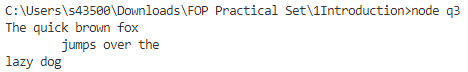
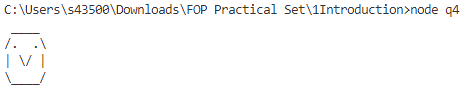
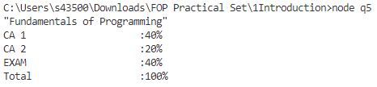

# 2. Operations

> Press `CTRL + SHIFT + V` to view the pretty version

## Topic Overview

This set of problems focuses on the use of:

-   Operators

## Instructions

1. To run the program:
    - Run `node q.js`

## Screenshot of expected outputs

Q3:

Q4:

Q5:

